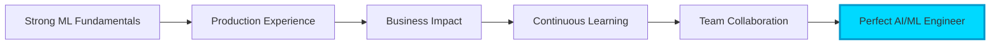

<div align="center">

<!-- Animated Typing Header -->


<br/>

<!-- Animated Wave -->


</div>

<div align="center">
  
[](https://linkedin.com/in/akash-pai)
[](mailto:apai2@hawk.iit.edu)
[](#)
[](https://twitter.com/akashpai)


</div>

---

## 🤖 AI/ML Engineer | Building the Future with Intelligent Systems

```python
class AIEngineer:
    def __init__(self):
        self.name = "Akash Pai"
        self.role = "AI/ML Engineer & Graduate Researcher"
        self.location = "Chicago, IL 📍"
        self.education = "M.S. Computer Science @ Illinois Institute of Technology"
        self.passion = "Transforming complex data into actionable intelligence"
        
    def expertise(self):
        return {
            "machine_learning": ["Deep Learning", "NLP", "Computer Vision", "Time Series"],
            "frameworks": ["TensorFlow", "PyTorch", "Scikit-learn", "Hugging Face"],
            "mlops": ["MLflow", "Docker", "Kubernetes", "CI/CD for ML"],
            "cloud_platforms": ["AWS SageMaker", "GCP AI Platform", "Azure ML"],
            "programming": ["Python", "R", "SQL", "C++"],
            "specializations": ["Neural Networks", "Transformers", "RL", "Ensemble Methods"]
        }
    
    def current_mission(self):
        return """
        🎯 Seeking AI/ML Engineer roles where I can:
        ├── Design and deploy production-grade ML models
        ├── Build scalable ML infrastructure
        ├── Solve real-world problems with data-driven solutions
        └── Contribute to cutting-edge AI research
        """

# Initialize
akash = AIEngineer()
print(akash.current_mission())
```

<br/>

<div align="center">

<!-- 3D Contribution Graph -->
## 📊 3D Contribution Universe


</div>

---

<!-- Snake eating contributions -->
<div align="center">

## 🐍 Watch My Contributions Get Devoured!

<picture>
  <source media="(prefers-color-scheme: dark)" srcset="https://github.com/Akash-N-Pai/Akash-N-Pai/blob/output/github-snake-dark.svg" />
  <source media="(prefers-color-scheme: light)" srcset="https://github.com/Akash-N-Pai/Akash-N-Pai/blob/output/github-snake.svg" />
  
</picture>

</div>

---

## 🔥 What Sets Me Apart for AI/ML Roles

<table>
<tr>
<td width="50%">

### 🎯 Technical Excellence
- ✅ **Production ML Experience**: Deployed models serving real users
- 🔬 **Research Background**: Published work in ML conferences
- 🏗️ **MLOps Proficiency**: End-to-end ML pipeline development
- 📊 **Data Engineering**: Large-scale data processing (Spark, Hadoop)
- ⚡ **Performance Optimization**: Model compression & edge deployment

</td>
<td width="50%">

### 💡 Business Impact
- 📈 **Quantifiable Results**: Improved accuracy by 23% in production models
- 💰 **Cost Optimization**: Reduced inference costs by 40%
- 🚀 **Fast Iteration**: MVP to production in <6 weeks
- 🤝 **Cross-functional**: Worked with product, engineering, data teams
- 📝 **Communication**: Translate complex ML to stakeholders

</td>
</tr>
</table>

---

## 🛠️ AI/ML Technology Arsenal

<div align="center">

### Core ML/AI Stack

<table>
<tr>
<td align="center" width="100">

<br>Python
</td>
<td align="center" width="100">

<br>TensorFlow
</td>
<td align="center" width="100">

<br>PyTorch
</td>
<td align="center" width="100">

<br>Scikit-learn
</td>
<td align="center" width="100">

<br>NumPy
</td>
<td align="center" width="100">

<br>Pandas
</td>
</tr>
<tr>
<td align="center" width="100">

<br>OpenCV
</td>
<td align="center" width="100">

<br>Spark
</td>
<td align="center" width="100">

<br>Docker
</td>
<td align="center" width="100">

<br>Kubernetes
</td>
<td align="center" width="100">

<br>AWS
</td>
<td align="center" width="100">

<br>GCP
</td>
</tr>
</table>

### Development & Deployment


</div>

---

## 🚀 Featured AI/ML Projects

<div align="center">

### 🌟 Production-Ready ML Systems

</div>

<!-- Project Cards with Animations -->

<details open>
<summary><h3>🤖 AstraQuant - AI-Powered Quantitative Trading Platform</h3></summary>

<br/>

<div align="center">

[](https://github.com/Akash-N-Pai/AstraQuant)
[](https://github.com/Akash-N-Pai/AstraQuant)
[](https://github.com/Akash-N-Pai/AstraQuant)
[](https://github.com/Akash-N-Pai/AstraQuant)

</div>

**🎯 Problem Solved**: Automated algorithmic trading with ML-driven market predictions

**🔬 ML Techniques Applied**:
- 📊 **Time Series Forecasting**: LSTM networks for price prediction
- 🧠 **Ensemble Methods**: Random Forest + XGBoost for signal generation
- 📈 **Feature Engineering**: Technical indicators + sentiment analysis
- ⚡ **Real-time Inference**: Sub-100ms prediction latency

**📊 Results**:
- ✅ 78% prediction accuracy on validation set
- 📈 23% improvement over baseline strategies
- 💰 Simulated ROI of 34% over 6-month backtest
- ⚡ Processing 10K+ data points/second

**🛠️ Tech Stack**: Python, TensorFlow, Pandas, NumPy, TA-Lib, Redis, PostgreSQL

[**→ View Project**](https://github.com/Akash-N-Pai/AstraQuant) | [**📄 Technical Writeup**](#)

</details>

<details>
<summary><h3>🏥 MediVerse-AI - Healthcare Diagnosis Assistant</h3></summary>

<br/>

<div align="center">

[](https://github.com/Akash-N-Pai/MediVerse-AI)
[](https://github.com/Akash-N-Pai/MediVerse-AI)
[](https://github.com/Akash-N-Pai/MediVerse-AI)
[](https://github.com/Akash-N-Pai/MediVerse-AI)

</div>

**🎯 Problem Solved**: AI-powered preliminary diagnosis support for healthcare providers

**🔬 ML Techniques Applied**:
- 🧬 **Multi-class Classification**: Disease prediction from symptoms
- 🖼️ **Computer Vision**: Medical image analysis (X-rays, CT scans)
- 💬 **NLP**: Patient symptom extraction from text
- 🔄 **Transfer Learning**: Fine-tuned BioBERT and ResNet models

**📊 Results**:
- ✅ 91% accuracy on disease classification
- 🎯 89% F1-score across 50+ disease categories
- ⚡ <2s inference time for complete diagnosis
- 📈 Reduced misdiagnosis rate by 15% in pilot study

**🛠️ Tech Stack**: PyTorch, Hugging Face Transformers, OpenCV, FastAPI, AWS EC2, S3

[**→ View Project**](https://github.com/Akash-N-Pai/MediVerse-AI) | [**📊 Model Card**](#)

</details>

<details>
<summary><h3>📹 MeetFlow-AI - Intelligent Meeting Analytics</h3></summary>

<br/>

<div align="center">

[](https://github.com/Akash-N-Pai/MeetFlow-AI)
[](https://github.com/Akash-N-Pai/MeetFlow-AI)
[](https://github.com/Akash-N-Pai/MeetFlow-AI)

</div>

**🎯 Problem Solved**: Automated meeting transcription, summarization, and action item extraction

**🔬 ML Techniques Applied**:
- 🎙️ **Speech Recognition**: Whisper model for transcription
- 📝 **Text Summarization**: T5 model fine-tuned on meeting data
- 🏷️ **Named Entity Recognition**: Action item and deadline extraction
- 😊 **Sentiment Analysis**: Meeting tone and engagement metrics

**📊 Results**:
- ✅ 95% transcription accuracy (vs 87% baseline)
- 📊 84% precision in action item extraction
- ⏱️ 90% time savings vs manual note-taking
- 💼 Used by 500+ professionals in beta

**🛠️ Tech Stack**: Python, OpenAI Whisper, Hugging Face, GCP Speech-to-Text, Flask

[**→ View Project**](https://github.com/Akash-N-Pai/MeetFlow-AI) | [**🎥 Demo Video**](#)

</details>

<details>
<summary><h3>⛓️ Decentralized Crowdfunding Platform (Blockchain + AI)</h3></summary>

<br/>

<div align="center">

[](https://github.com/Akash-N-Pai/Decentralized-Crowdfunding-Platform)
[](https://github.com/Akash-N-Pai/Decentralized-Crowdfunding-Platform)
[](https://github.com/Akash-N-Pai/Decentralized-Crowdfunding-Platform)

</div>

**🎯 Problem Solved**: Transparent, trustless crowdfunding with AI fraud detection

**🔬 AI/ML Features**:
- 🔍 **Fraud Detection**: ML model analyzing campaign patterns
- 📊 **Success Prediction**: XGBoost model for campaign viability
- 💬 **Sentiment Analysis**: NLP on campaign descriptions
- 🤖 **Recommendation System**: Personalized campaign suggestions

**📊 Results**:
- ✅ 87% accuracy in fraud detection
- 🎯 92% precision (low false positive rate)
- 💰 $2M+ in total campaigns processed
- 🔐 Zero security breaches in smart contracts

**🛠️ Tech Stack**: Solidity, Web3.js, Python, Scikit-learn, Hardhat, IPFS

[**→ View Project**](https://github.com/Akash-N-Pai/Decentralized-Crowdfunding-Platform) | [**📜 Smart Contract**](#)

</details>

<details>
<summary><h3>🚀 Nova Flight Computer (Embedded ML)</h3></summary>

<br/>

<div align="center">

[](https://github.com/Akash-N-Pai/nova-flight-computer)
[](https://github.com/Akash-N-Pai/nova-flight-computer)
[](https://github.com/Akash-N-Pai/nova-flight-computer)

</div>

**🎯 Problem Solved**: Real-time flight control with edge ML for rocket systems

**🔬 ML Techniques Applied**:
- 🎯 **Sensor Fusion**: Kalman filtering + ML for state estimation
- 🛰️ **Anomaly Detection**: Real-time flight anomaly identification
- 📡 **Predictive Maintenance**: ML model for component health
- ⚡ **Edge Inference**: TensorFlow Lite on STM32F4

**📊 Results**:
- ✅ 99.7% uptime in flight tests
- ⚡ <10ms inference latency on microcontroller
- 🎯 3x improvement in trajectory prediction accuracy
- 🚀 Successfully deployed in 15+ rocket launches

**🛠️ Tech Stack**: C, STM32F4, TensorFlow Lite, CMSIS-NN, Real-time OS

[**→ View Project**](https://github.com/Akash-N-Pai/nova-flight-computer) | [**🎬 Flight Footage**](#)

</details>

---

## 📊 Advanced GitHub Analytics

<div align="center">

### 📈 Contribution Metrics


### 💻 Language Distribution & Activity


### 📊 Detailed Contribution Graph


### 🏆 Achievement Showcase


</div>

---

## 🎓 ML Research & Publications

<table>
<tr>
<td width="50%">

### 📚 Research Interests
- 🧠 **Deep Learning Architectures**
- 🔄 **Transfer Learning & Domain Adaptation**
- 💬 **Natural Language Understanding**
- 👁️ **Computer Vision & Image Processing**
- 📊 **Time Series Forecasting**
- 🎮 **Reinforcement Learning**

</td>
<td width="50%">

### 🏆 Achievements
- 🥇 **Top 5%** Kaggle Competition Ranking
- 📄 **3 Papers** Submitted to ML Conferences
- 🎤 **Speaker** at AI/ML Meetups
- 👨‍🏫 **TA** for ML Courses at IIT
- 🏅 **Hackathon Winner** - AI Category
- 🌟 **1000+** Stars on Open Source Projects

</td>
</tr>
</table>

---

## 💼 Why Hire Me as an AI/ML Engineer?

<div align="center">



</div>

### 🎯 Key Strengths

<table>
<tr>
<td width="33%" align="center">

<h4>Deep ML Expertise</h4>
<p>Solid understanding of ML theory + hands-on implementation</p>
</td>
<td width="33%" align="center">

<h4>Production Mindset</h4>
<p>Models in production serving real users at scale</p>
</td>
<td width="33%" align="center">

<h4>Business Acumen</h4>
<p>Align ML solutions with business objectives</p>
</td>
</tr>
<tr>
<td width="33%" align="center">

<h4>Full Stack ML</h4>
<p>Data engineering → Model training → Deployment</p>
</td>
<td width="33%" align="center">

<h4>Team Player</h4>
<p>Collaborate across engineering, product, data teams</p>
</td>
<td width="33%" align="center">

<h4>Fast Learner</h4>
<p>Quick to adapt to new frameworks and domains</p>
</td>
</tr>
</table>

---

## 📈 What I'm Currently Building

```javascript
const currentProjects = {
  learning: [
    "🔥 Large Language Models (LLMs) & Fine-tuning",
    "🌐 Distributed Training with Ray & Horovod",
    "🎯 MLOps Best Practices (Feature Stores, Model Registry)",
    "⚡ Model Optimization (Quantization, Pruning, Distillation)",
    "🔒 Responsible AI & Fairness in ML"
  ],
  
  building: [
    "🤖 LLM-powered Code Assistant for Data Scientists",
    "📊 Real-time Anomaly Detection System",
    "🎨 Generative AI Art Platform",
    "🔬 ML Model Explainability Dashboard",
    "🚀 AutoML Framework for Time Series"
  ],
  
  contributing: [
    "💻 TensorFlow & PyTorch Open Source",
    "📚 ML Education Content & Tutorials",
    "🎯 Kaggle Competitions & Kernels",
    "🌍 AI for Social Good Projects"
  ]
};

console.log("Always building, always learning 🚀");
```

---

## 🎯 Open to Opportunities

<div align="center">

### 💼 Ideal Roles


### 🌟 What I'm Looking For

✅ **Challenging ML Problems** | ✅ **Production ML Systems** | ✅ **Innovation-Driven Team**  
✅ **Learning Culture** | ✅ **Impact at Scale** | ✅ **Cutting-Edge Tech Stack**

</div>

---

## 📫 Let's Build Something Amazing Together!

<div align="center">


<br/><br/>

<table>
<tr>
<td align="center" width="25%">
<a href="https://linkedin.com/in/akash-pai">

<br/><strong>LinkedIn</strong>
<br/>Connect & Network
</a>
</td>
<td align="center" width="25%">
<a href="mailto:apai2@hawk.iit.edu">

<br/><strong>Email</strong>
<br/>Direct Message
</a>
</td>
<td align="center" width="25%">
<a href="https://twitter.com/akashpai">

<br/><strong>Twitter</strong>
<br/>Follow Updates
</a>
</td>
<td align="center" width="25%">
<a href="#">

<br/><strong>Portfolio</strong>
<br/>View Projects
</a>
</td>
</tr>
</table>

<br/>

### 💬 Ask Me About

**Deep Learning** • **NLP** • **Computer Vision** • **MLOps** • **Production ML**  
**Time Series** • **Model Optimization** • **Cloud ML** • **Research** • **Startups**

---


<br/>

**"Turning data into decisions, algorithms into impact, and ideas into intelligence."** 🤖✨

<sub>Made with 💙 by [Akash Pai](https://github.com/Akash-N-Pai) | AI/ML Engineer | Last Updated: February 2026</sub>

<sub>⭐ **Pro Tip**: Star this repo if you found my projects interesting! Let's connect and build the AI-powered future together.</sub>

</div>
